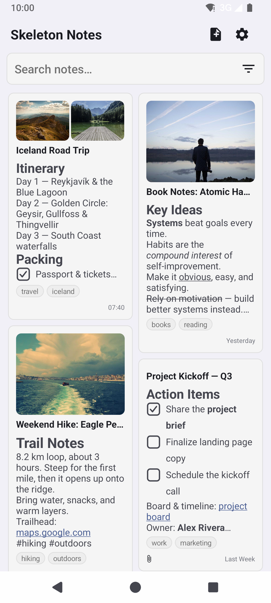
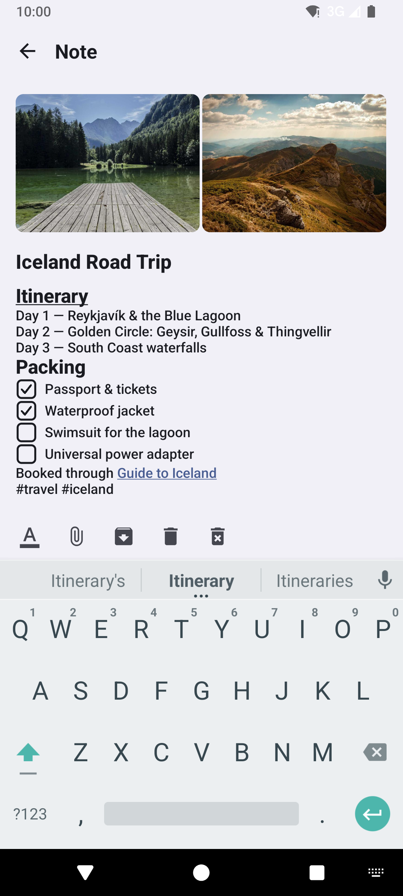
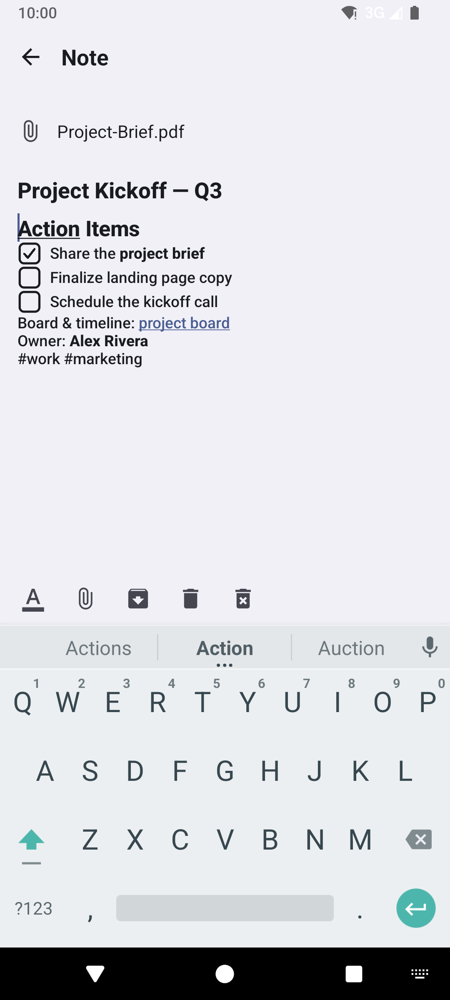
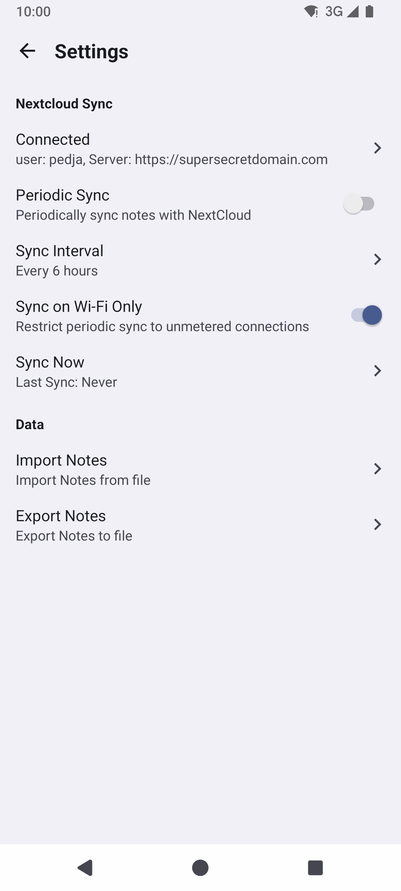

# 💀 Skeleton Notes
## Dead simple note taking app ⚰️

  
  
  
  

### Feature
- Taking notes
- That is all 😶

### Installing
- Install from release page, it is not that hard 🙄[^1]
- Or from these sources...  

- SHA-256: `CB:2E:16:E4:D0:95:24:BF:48:5A:0E:A4:F2:6A:E7:06:AA:30:CD:F6:0A:F0:B0:73:B2:9C:61:68:12:0D:83:94`
### Building
- Ok, sure, this is a bit more complicated, but also, not really
- Install Android Sutdio
- Import project
- Click run (the green triangle button, you can't miss it 🫣)

### Submitting issues/bugs/feature requests
- I mean, there is literaly a tab called Issues above 🤷

### Technology Stack
- Latest android technologies and tools are used
- XML for UI
- SQLiteOpenHelper with Curosor and ContentValues for database
- Activity for every screen
- [r/Pretend2010Internet ](https://www.reddit.com/r/Pretend2010Internet/)

### Contributing
#### Ok, this section is serious
- PR description is required, please describe what your PR does, PRs without description will be rejected
- PR check pipeline must be green, I will not even look at your PR if it is not green
- Keep the project **minimalistic, simple, and lightweight**.
- Avoid unnecessary complexity, frameworks, or dependencies.
    - PR with new runtime dependency will be rejected unless there is a really good reason to introduce new dependency, and was discussed with maintainer beforehand
    - Debugging/Testing depndencies, as well as plugins that don't introduce runtime dependencies are allowed
    - Yes I have heard of Jetpack Compose, No you cannot use Compose, it is a complete overkill for this app
- Always follow te project architecture. Project uses **clean architecture**
    - `:app` module contains UI of the app
    - `:domain` module contains bussiness logic, models, interfaces, etc
    - `:data` module contains implemtations for interfacase from domain
    - Use kotlin visiblity modifier, `:app` and `:domain` can never access anything from `:data` directly, `:data` cannot access `:app`
- MVVM pattern is used, don't skip Use Case classes, even if they are very simple
- Always document all classes/files/functions/properties (KDoc)
- If you modify any pipeline code, you must have a very good reason for it. Don't disable verifications, etc
- Alwasy write/update tests
    - Never use backticks "`", even for unit tests.
    - Alwasy use camelCase
- Using AI is allowed as long as all the above rules are followed
    - Please don't Vibe Code a PR without even checking the code yourself
    - Repeatedly submitting AI slop (or Human slop) will get you a permanent ban from contributing (can i even do that?)
- If you add `@Suppress` for detekt issues, you must have a very good reason for it

## Reason for used dependencies
- androidx.activity:activity-ktx - I don't remember, too lazy to search now 🥱
- androidx.lifecycle:lifecycle-viewmodel-ktx - MVVM architecture
- org.jetbrains.kotlin:kotlin-stdlib - Java sucks
- org.jetbrains.kotlinx:kotlinx-coroutines - I could have used AsyncTask instead, i guess... 🤪
- androidx.databinding:viewbinding - alternative is `findViewById`, I am not a masochist 🤕
- com.squareup.okhttp3:okhttp - Nextcloud uses WebDav for file access, which uses `PROPFIND` and `MKCOL` http methods which aren't supported in `HttpUrlConnection`
- androidx.browser:browser - Nextcloud Flow V2 login
- androidx.recyclerview:recyclerview - GridView sucks

### License
    Copyright (C) 2026  pedja

    This program is free software: you can redistribute it and/or modify
    it under the terms of the GNU General Public License as published by
    the Free Software Foundation, either version 3 of the License, or
    (at your option) any later version.

    This program is distributed in the hope that it will be useful,
    but WITHOUT ANY WARRANTY; without even the implied warranty of
    MERCHANTABILITY or FITNESS FOR A PARTICULAR PURPOSE.  See the
    GNU General Public License for more details.

    You should have received a copy of the GNU General Public License
    along with this program.  If not, see <http://www.gnu.org/licenses/>.

[^1]: Yes I like smilies, No I didn't use AI to write this readme (my sense of humor sucks, i know, deal with it 🤡)

